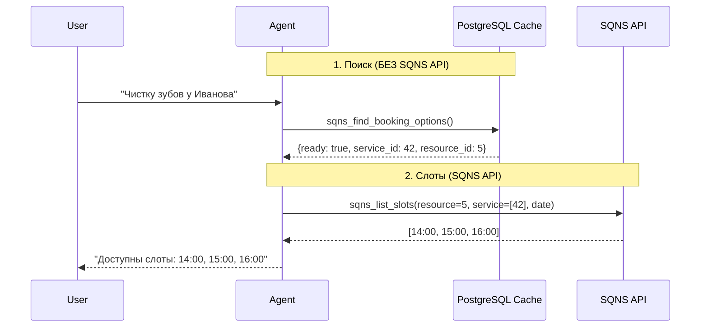

# SQNS Smart Agent Integration

## Обзор

SQNS Smart Agent Integration - это интеллектуальная система бронирования с кэшированием данных в PostgreSQL, которая минимизирует контекст для AI агента и обеспечивает быстрый доступ к данным.

## Архитектура

### 🎯 Основные компоненты

1. **Кэш в PostgreSQL (4 таблицы)**
   - `sqns_resources` - специалисты (врачи)
   - `sqns_services` - услуги
   - `sqns_service_resources` - связи M2M
   - `sqns_service_categories` - категории с настройками

2. **Умный инструмент `sqns_find_booking_options`**
   - Один инструмент вместо трех отдельных
   - Автоматическая валидация совместимости
   - Подсказка альтернатив при ошибках

3. **SQNSSyncService**
   - Синхронизация данных из SQNS API
   - Специалисты загружаются через `GET /api/v2/employee` (`page`, `perPage`, `isFired=0`, `isDeleted=0`)
   - Upsert логика для обновлений
   - Устаревшие специалисты помечаются как неактивные (`is_active=false`), без hard delete
   - Умный поиск с ILIKE

4. **7 новых API endpoints**
   - Управление синхронизацией
   - Настройка услуг/категорий
   - Hard delete при отключении

## 🚀 Быстрый старт

### 1. Применить миграцию

```bash
cd backend
alembic upgrade head
```

### 2. Включить SQNS для агента

```bash
POST /api/agents/{agent_id}/sqns/enable-by-password
{
  "host": "your-sqns-instance.com",
  "email": "user@example.com",
  "password": "password"
}
```

**Автоматически произойдет:**

- Подключение к SQNS
- Синхронизация услуг и активных специалистов в БД
- Создание кэша для быстрого доступа

### 3. Агент готов к работе!

Агент автоматически использует инструмент `sqns_find_booking_options` для поиска.

## 📊 Примеры использования

### Агент: Найти услугу по специалисту

**Клиент:** "Хочу к доктору Иванову"

**Агент вызывает:**

```python
sqns_find_booking_options(specialist_name="Иванов")
```

**Ответ:**

```json
{
  "ready": false,
  "resource_id": 5,
  "resource_name": "Иванов Иван Иванович",
  "message": "Специалист Иванов Иван Иванович может выполнить 12 услуг. Выберите услугу.",
  "alternatives": {
    "services": [
      {
        "id": 42,
        "name": "Профессиональная чистка зубов",
        "additional_info": "60 мин • 3500 руб."
      },
      {
        "id": 43,
        "name": "Отбеливание зубов",
        "additional_info": "90 мин • 8000 руб."
      }
    ]
  }
}
```

### Агент: Проверить совместимость

**Клиент:** "Чистку зубов у Иванова"

**Агент вызывает:**

```python
sqns_find_booking_options(
    service_name="чистка",
    specialist_name="Иванов"
)
```

**Ответ (если совместимы):**

```json
{
  "ready": true,
  "service_id": 42,
  "service_name": "Профессиональная чистка зубов",
  "resource_id": 5,
  "resource_name": "Иванов Иван Иванович",
  "duration_seconds": 3600,
  "price": "3500 руб.",
  "message": "✓ Готово к записи: Иванов Иван Иванович выполнит 'Профессиональная чистка зубов' (60 мин)"
}
```

**Следующий шаг:**

```python
# Теперь агент может сразу получить слоты
sqns_list_slots(
    resource_id=5,
    date="2026-01-29",
    service_ids=[42]
)
```

**Ответ (если НЕ совместимы):**

```json
{
  "ready": false,
  "message": "✗ Иванов Иван Иванович не может выполнить 'Имплантация зубов'. Выберите другого специалиста или другую услугу.",
  "alternatives": {
    "other_specialists": [
      { "id": 7, "name": "Петров Петр Петрович", "additional_info": "Хирург" },
      { "id": 9, "name": "Сидорова Мария", "additional_info": "Хирург" }
    ],
    "other_services": [
      {
        "id": 42,
        "name": "Профессиональная чистка зубов",
        "additional_info": "60 мин"
      },
      { "id": 43, "name": "Отбеливание зубов", "additional_info": "90 мин" }
    ]
  }
}
```

## 🔧 API Endpoints

### 1. Синхронизация данных

```bash
POST /api/agents/{agent_id}/sqns/sync
```

**Описание:** Ручная синхронизация услуг и специалистов из SQNS

**Response:**

```json
{
  "success": true,
  "message": "Синхронизировано: 247 услуг, 15 специалистов, 8 категорий; деактивировано 2 неактуальных специалистов",
  "resources_synced": 15,
  "services_synced": 247,
  "categories_synced": 8,
  "links_synced": 523,
  "synced_at": "2026-01-28T12:34:56Z"
}
```

### 2. Список услуг

```bash
GET /api/agents/{agent_id}/sqns/services/cached?search=чистка&is_enabled=true&limit=20
```

**Query Parameters:**

- `search` - поиск по названию/описанию (ILIKE)
- `category` - фильтр по категории
- `is_enabled` - только включенные/отключенные
- `limit` - максимум результатов (1-100)
- `offset` - пагинация

**Response:**

```json
{
  "services": [
    {
      "id": "uuid",
      "external_id": 42,
      "name": "Профессиональная чистка зубов",
      "category": "Терапия",
      "price": 3500.0,
      "duration_seconds": 3600,
      "is_enabled": true,
      "priority": 10,
      "specialists_count": 5
    }
  ],
  "total": 1
}
```

### 3. Обновить услугу

```bash
PATCH /api/agents/{agent_id}/sqns/services/{service_id}
{
  "is_enabled": false,
  "priority": 0
}
```

### 4. Массовое обновление услуг

```bash
POST /api/agents/{agent_id}/sqns/services/bulk-update
{
  "service_ids": ["uuid1", "uuid2", "uuid3"],
  "is_enabled": true,
  "priority": 5
}
```

**Response:**

```json
{
  "updated_count": 3,
  "message": "Successfully updated 3 services"
}
```

### 5. Список категорий

```bash
GET /api/agents/{agent_id}/sqns/categories
```

**Response:**

```json
{
  "categories": [
    {
      "id": "uuid",
      "name": "Терапия",
      "is_enabled": true,
      "priority": 10,
      "services_count": 45
    }
  ]
}
```

### 6. Обновить категорию

```bash
PATCH /api/agents/{agent_id}/sqns/categories/{category_id}
{
  "is_enabled": false,
  "priority": 0
}
```

### 7. Предпросмотр удаления

```bash
GET /api/agents/{agent_id}/sqns/disable-preview
```

**Response:**

```json
{
  "will_be_deleted": {
    "resources": 15,
    "services": 247,
    "service_resource_links": 523,
    "categories": 8
  },
  "warning": "Все эти данные будут удалены без возможности восстановления при отключении SQNS."
}
```

## 🎛️ Frontend управление

### Настройка услуг

1. **Отключить дорогие услуги**

   ```bash
   # Отключить все услуги дороже 10000 руб
   PATCH /services/{id} {"is_enabled": false}
   ```

2. **Приоритеты**

   ```bash
   # Популярные услуги - высокий приоритет
   PATCH /services/{id} {"priority": 10}
   ```

3. **Массовое управление**
   ```bash
   # Отключить всю категорию "Косметология"
   PATCH /categories/{id} {"is_enabled": false}
   ```

### Результат для агента

- **До настройки:** Агент видит 500+ услуг
- **После настройки:** Агент видит только 50 релевантных услуг
- **Эффект:** Контекст уменьшен в 10 раз, скорость ответа выше!

## 🔐 Безопасность

### Soft Warning для дубликатов

При подключении нескольких агентов к одному SQNS аккаунту:

```json
{
  "sqns_warning": "Внимание: 2 других агентов уже подключены к этому SQNS аккаунту. Это может привести к конфликтам данных."
}
```

### Hard Delete при отключении

При вызове `/sqns/disable`:

```sql
-- Все данные удаляются БЕЗВОЗВРАТНО
DELETE FROM sqns_service_resources WHERE ...
DELETE FROM sqns_services WHERE agent_id = ?
DELETE FROM sqns_resources WHERE agent_id = ?
DELETE FROM sqns_service_categories WHERE agent_id = ?
```

## ⚡ Производительность

### Сравнение с/без кэша

| Операция        | Без кэша     | С кэшем      | Улучшение              |
| --------------- | ------------ | ------------ | ---------------------- |
| Поиск услуги    | 2-5 сек      | 10-50 мс     | **50-500x**            |
| Контекст агента | 500+ услуг   | 3-5 услуг    | **Уменьшение в 100x**  |
| Валидация       | 3 API вызова | 1 SQL запрос | **3x меньше запросов** |

### ILIKE с GIN индексами

```sql
-- Быстрый поиск по содержанию
SELECT * FROM sqns_services
WHERE name ILIKE '%чист%'  -- Найдет "чистка", "Чистка зубов", "Профчистка"
-- Использует GIN index с trigrams (pg_trgm)
```

## 🔄 Workflow агента



## 📚 Best Practices

### ✅ Следуем стандартам

1. **Tool Composition** - один умный инструмент вместо трех
2. **Smart Filtering** - логика в коде, не в промпте
3. **Caching Strategy** - локальный кэш для скорости
4. **Clear I/O Schema** - Pydantic модели для валидации
5. **Error Handling** - автоматические альтернативы

### ⚡ Оптимизация

1. **Синхронизация раз в день** (или по кнопке)
2. **GIN индексы** для ILIKE поиска
3. **LIMIT 20** в запросах к кэшу
4. **ON DELETE CASCADE** для чистого удаления

## 🐛 Troubleshooting

### Проблема: Агент не находит услугу

**Решение:**

```bash
# 1. Проверить синхронизацию
GET /agents/{id}/sqns/services/cached?search=название

# 2. Принудительная ресинхронизация
POST /agents/{id}/sqns/sync
```

### Проблема: Устаревшие данные

**Решение:**

```bash
# Обновить кэш
POST /agents/{id}/sqns/sync
```

### Проблема: Агент видит слишком много услуг

**Решение:**

```bash
# Отключить ненужные категории
PATCH /agents/{id}/sqns/categories/{cat_id}
{"is_enabled": false}
```

## 📖 Дополнительные ресурсы

- [MCP Specification](https://modelcontextprotocol.io/)
- [Pydantic AI Documentation](https://ai.pydantic.dev/)
- [FastMCP Guide](https://github.com/jlowin/fastmcp)
- [PostgreSQL Trigrams](https://www.postgresql.org/docs/current/pgtrgm.html)
