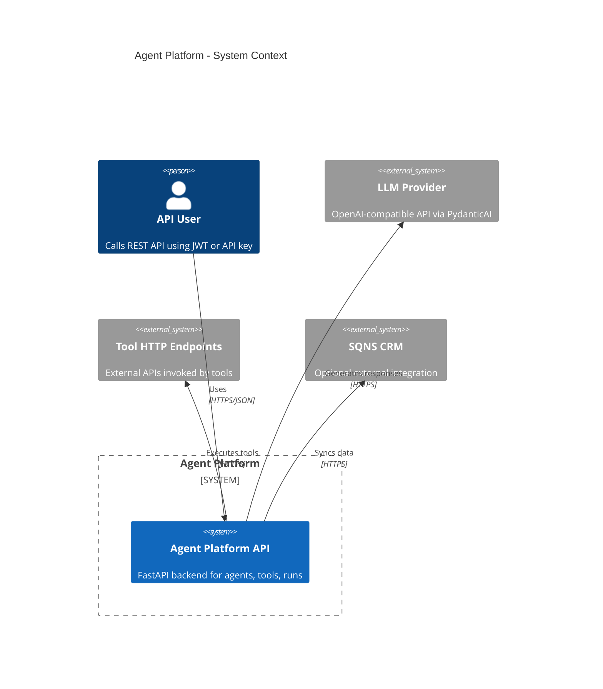
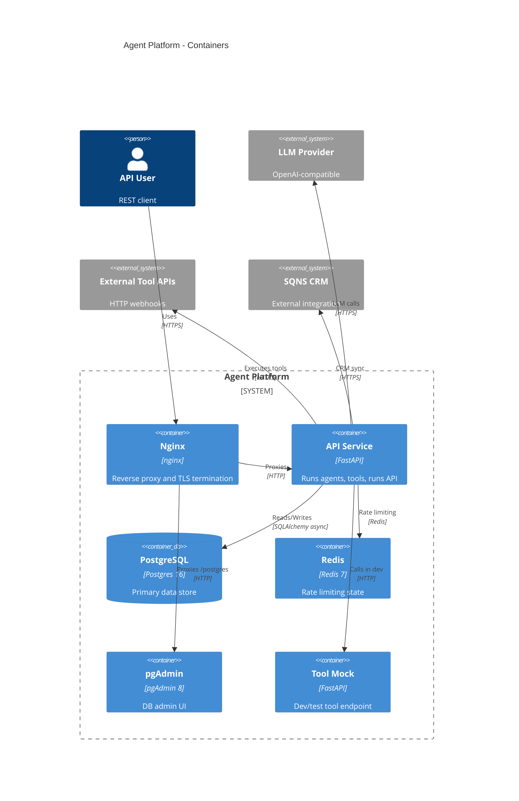
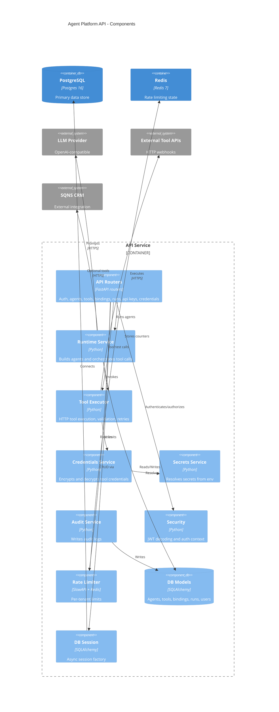
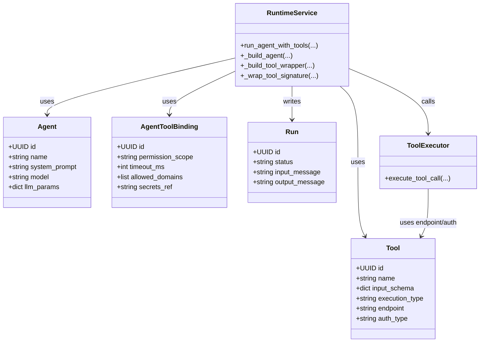

# C4 Architecture Diagrams

This document captures the current architecture of the Agent Platform API using the C4 model.
It is derived from the backend code and deployment config in this repository.

## Context

## Containers

## Components (API Service)

## Code (Agent Execution)

## Sources

- `README.md`
- `docker-compose.yml`
- `backend/app/main.py`
- `backend/app/api/routers/`
- `backend/app/services/runtime.py`
- `backend/app/services/tool_executor.py`
- `backend/app/db/models/`
- `backend/app/core/`
