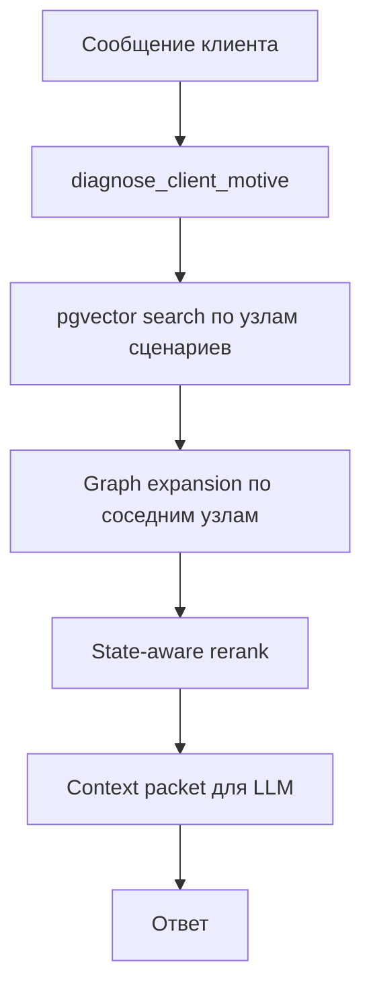

# План развития сценарного retrieval на pgvector

## Цель

Упростить архитектуру expert scenarios, сохранив сильную сторону текущего подхода:

- ответы остаются насыщенными и тактически точными;
- сценарии продолжают работать как graph-shaped knowledge;
- уменьшается сложность indexing lifecycle и зависимость от legacy-компонентов.

## Текущие проблемы

- раньше retrieval был завязан на отдельный storage/runtime слой;
- раньше использовался отдельный custom KG compiler;
- дебаг и reasoning retrieval слишком завязаны на внешний механизм;
- source of truth сценария уже находится в Postgres JSON, но retrieval живёт отдельно.

## Целевая модель

## Принципы

- `flow_definition` остаётся source of truth.
- Факты по ценам, услугам, сотрудникам не переезжают в retrieval-слой.
- Retrieval ищет не весь flow целиком, а релевантные узлы.
- После semantic match нужен локальный graph expansion:
  - parent trigger,
  - соседний question,
  - linked business rule,
  - next step hints,
  - motive/proof/objection context.

## Предлагаемая data model

### 1. `script_flow_nodes_index`

Хранит одну строку на индексируемый узел.

Поля:

- `id`
- `tenant_id`
- `agent_id`
- `flow_id`
- `flow_version`
- `node_id`
- `node_type`
- `stage`
- `title`
- `content_text`
- `embedding vector(1536)`
- `service_ids jsonb`
- `employee_ids jsonb`
- `motive_ids jsonb`
- `objection_ids jsonb`
- `proof_ids jsonb`
- `constraint_ids jsonb`
- `required_followup_question`
- `communication_style`
- `preferred_phrases jsonb`
- `forbidden_phrases jsonb`
- `is_searchable`

### 2. `script_flow_edges_index`

Нормализованная проекция edges для graph expansion.

Поля:

- `id`
- `tenant_id`
- `agent_id`
- `flow_id`
- `source_node_id`
- `target_node_id`
- `branch_label`
- `source_handle`

### 3. `script_flow_retrieval_snapshots`

Опционально: кэш собранного retrieval packet для опубликованной версии сценария.

## Как будет работать retrieval

### Шаг 1. Node-level semantic search

Ищем top-k узлов по `embedding <=> query_embedding`.

### Шаг 2. Local graph expansion

Для каждого top node подтягиваем:

- родительский trigger;
- ближайший question/condition;
- связанные rule/end/goto узлы;
- metadata узла.

### Шаг 3. State-aware rerank

Переиспользуем существующие идеи из `script_flow_tool.py`:

- boost по open objections;
- debuff по blocked tactics;
- debuff по уже заданным follow-up;
- session filtering по service/employee context.

### Шаг 4. Context packet

LLM получает не raw chunks, а компактный пакет:

- top tactic;
- why it fits;
- communication_style;
- preferred/forbidden phrases;
- hard constraints;
- required followup;
- next-step hints.

## План внедрения

### Фаза 1. Dual-write index

- добавить индексирование узлов и edges в Postgres/pgvector;
- ничего не ломать в runtime.

### Фаза 2. Shadow retrieval

- добавить новый retriever под feature flag;
- собирать результаты параллельно с legacy-путём;
- сравнивать top matches и quality на golden set.

### Фаза 3. Switch runtime

- перевести `search_script_flows` на новый retriever;
- legacy-path оставить как fallback.

### Фаза 4. Remove legacy dependency

- убрать custom KG compiler;
- убрать отдельный worker legacy-index;
- упростить index_status lifecycle.

## Что важно не потерять

- state-aware rerank;
- style injection from motives;
- required followup discipline;
- service/employee filtering;
- explainability of why a tactic was selected.

## Минимальный next step в коде

1. Добавить модели `script_flow_nodes_index` и `script_flow_edges_index`.
2. Написать compiler `flow_definition -> index rows`.
3. Подготовить retriever interface:
   - `search_script_flow_nodes(...)`
   - `expand_script_flow_neighborhood(...)`
   - `build_scenario_context_packet(...)`
4. Включить dual-write на publish/index.
